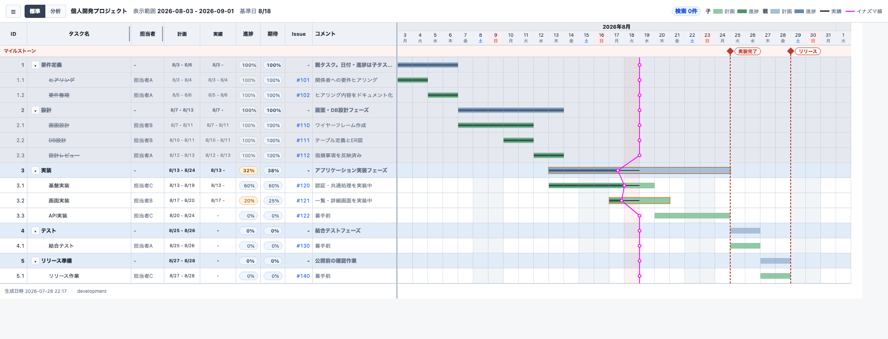
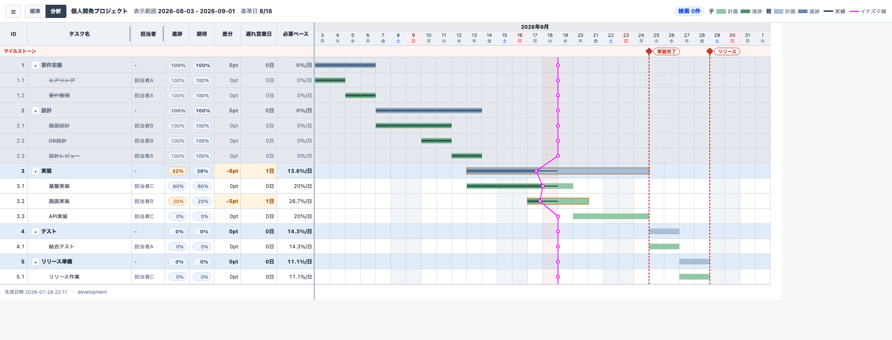

# WBS-GEN

WBS-GEN は、WBS とガントチャートを一枚の静的HTMLにまとめるローカルCLIです。アカウントやサーバーは不要です。



## コンセプト

WBS-GENは、WBSとガントチャートの管理を「ファイル1枚」に閉じ込めるローカルCLIです。正本はJSONまたは生成済みHTMLのどちらかを選べ、どちらもテキストベースなのでgitで差分管理できます。サーバーもアカウントも不要で、CLIコマンドとエディタでの手編集を自由に組み合わせて使えます。

## 動作環境

- Python 3.12 以上（OS不問。Windowsでは`python3`ではなく`python`コマンドになる場合があります）
- モダンブラウザ（生成したHTMLの閲覧に使用します）
- AIエージェント用Skillを使う場合: Skillを導入できるAIエージェント環境
- インターネット接続は不要です（祝日の自動取得コマンドを使う場合を除く）

## できること

- WBS表とガントチャートを1枚の静的HTMLに集約（担当者・計画/実績期間・進捗・Issueリンク・コメントを列表示）
- イナズマ線で進捗の遅れを可視化、警告タスクは自動ハイライト
- 分析タブで差分・遅れ営業日・必要ペースを確認
- マイルストーン表示、キーワード検索（フィルタ／ハイライト）
- 休日データの取り込み（JSON直接指定・外部JSONファイル、または内閣府CSVの自動取得。自動取得のみインターネット接続が必要）
- 表示列・表示レイヤーのカスタマイズ、URLクエリでの一時共有、JSON/Markdown/CSV/XLSXエクスポート



## ダウンロード

- 実行ファイル: [wbsgen.pyz](https://github.com/motahead/wbsgen-public/releases/latest/download/wbsgen.pyz)
- サンプル: [wbsgen-sample.json](https://github.com/motahead/wbsgen-public/releases/latest/download/wbsgen-sample.json)
- AIエージェント用Skill: [wbsgen-skill.zip](https://github.com/motahead/wbsgen-public/releases/latest/download/wbsgen-skill.zip)

CLIの使い方は[配布用マニュアル](https://github.com/motahead/wbsgen-public/releases/latest/download/wbsgen-manual.html)を参照してください。

## AIエージェント用Skill

WBS-GENはCLI（`wbsgen.pyz`）に加えて、AIエージェントが配布CLIを安全な手順で操作するためのSkillを提供しています。新規WBS作成、既存HTMLの更新、検証エラーの回復、JSON/Markdown/CSV/XLSX出力をエージェントに依頼する場面で使えます。

Skill名は`wbsgen`です。明示的に使いたい場合は、AIエージェントへ「`wbsgen` Skillを使用してください。既存の`project.html`を検証・更新してください」のように依頼します。スラッシュコマンドをサポートする環境では`/wbsgen`も使えます。

`wbsgen-skill.zip`を展開し、利用するAI製品の公式手順で定めるSkill検索パスへ`wbsgen/`を配置してください。具体例と注意事項は、archive内の`INSTALL.md`を開いて確認してください。SkillはCLIの代替ではなく、同じ作業ディレクトリに置いた`wbsgen.pyz`を操作するための補助です。Skillは、そのzipappの`wbsgen describe`と対象コマンドの`--help`を参照して利用可能な操作を把握します。

Skillの操作方法は、[配布用マニュアル](https://github.com/motahead/wbsgen-public/releases/latest/download/wbsgen-manual.html)のAIエージェント向け説明を参照してください。

## クイックスタート

1. wbsgen.pyz をダウンロードする（上記参照）
2. プロジェクトJSONを作る
   ```sh
   python3 wbsgen.pyz init project.json --name "個人開発"
   ```
3. HTMLを生成して開く
   ```sh
   python3 wbsgen.pyz generate project.json -o project.html
   ```
   `project.html` をブラウザで開くと、WBS表とガントチャートが表示されます。

## JSON運用: 一括編集・Git管理

JSONをエディターやスクリプトで管理し、HTML正本を作成します。

```sh
python3 wbsgen.pyz init project.json --name "個人開発"
python3 wbsgen.pyz generate project.json -o project.html
```

`generate` は入力JSONを変更せず、HTMLに埋め込むコピーへ生成元バージョンを記録します。既存の出力は拒否されるため、置換には `--overwrite` を指定します。

## HTML運用: 日々の参照・更新

生成済みHTMLをそのまま開き、日々の更新も同じファイルへ行えます。

```sh
python3 wbsgen.pyz task update project.html --id 1.2 --progress 50
python3 wbsgen.pyz refresh project.html
python3 wbsgen.pyz export json project.html -o backup.json
python3 wbsgen.pyz export markdown project.html -o project.md
python3 wbsgen.pyz export csv project.json -o project.csv --encoding utf-8-sig
```

更新コマンドは、埋め込みJSONを検証してHTML全体を再生成し、入力HTMLをアトミックに置き換えます。`--dry-run` は保存せずJSON差分だけを表示します。ブラウザー画面からの編集、クラウド同期の競合解決、自動同期は対象外です。

JSONとHTMLのどちらも `validate`、`export markdown`（別名 `export md`）、`export csv`、`export xlsx` に渡せます。Markdown は UTF-8 固定です。CSV は既定の UTF-8 に加えて、Excel 向けの `utf-8-sig`、Windows の Shift_JIS 相当である `cp932`（別名 `sjis`）を指定できます。

## 表示設定

`display.standard.columns` では標準ビューの列表示・初期幅・順序を、`display.analysis.columns.order` では分析ビューの列順を指定します。`display.layers.visible` はガントの表示レイヤーです。`order` は部分指定でき、未指定の列は既定順で末尾に追加されます。HTML上での並べ替えは一時的な表示操作で、JSONやXLSXには書き戻しません。

## テスト

ソースから動作を検証したい場合:

```sh
git clone https://github.com/motahead/wbsgen-public.git
cd wbsgen-public

mise run visual-install  # 初回のみ: visual profile用のChromiumを準備
mise run verify-code
mise run verify-distribution
mise run verify-visual
mise run verify-manual
mise run verify-pr       # まとめて実行する場合
```

各profileの目的は[docs/quality-definition.md](docs/quality-definition.md)を参照してください。

## 免責事項

個人開発のツールです。動作の保証や継続的なサポートは行いません。利用は自己責任でお願いします。

## ライセンス

[MIT License](LICENSE) — フォーク・改変・再配布は自由です。
